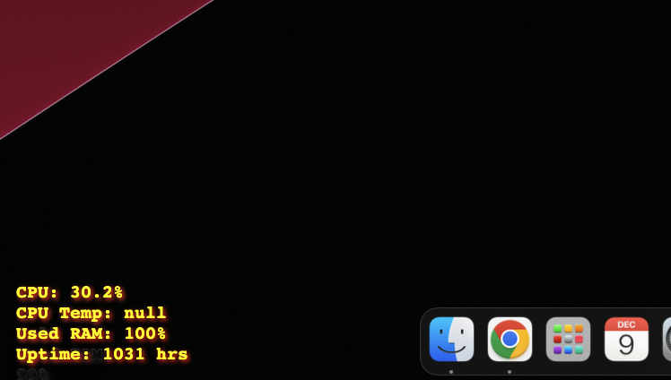

# specs-overlay
A transparent overlay to display important specs of your machine on top of other programs.
This is a very quick draft of this idea, more to come.. maybe.
Check out the config in src/ to turn on other specs and change the style. 

